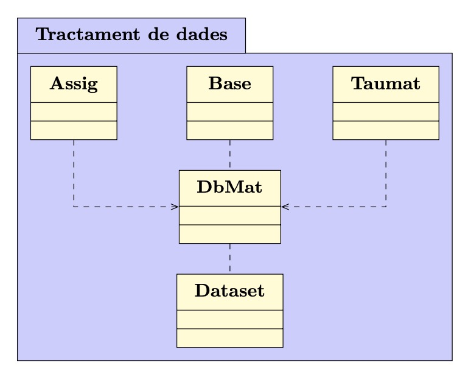
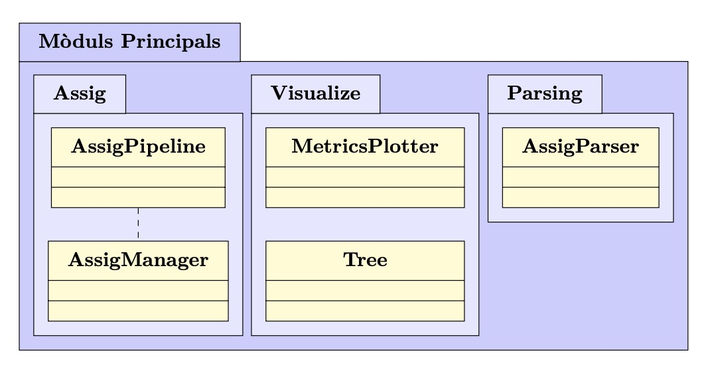
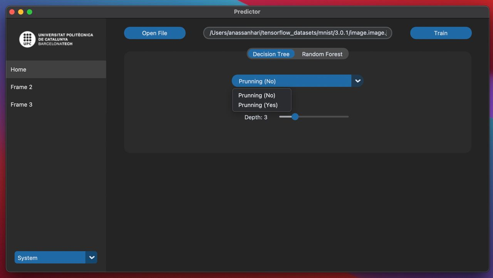

# <i><b><u>Predicció de Matrícula Basada en Aprenentatge Automàtic</u></b></i>

En aquest repositori s'ha publicat tot el codi font utilitzat en el meu treball
de fi de grau (TFG) a l'Universitat Politècnica de Barcelona. S'ha establert un
acord confidencial amb l'universitat, el que ha implicat l'eliminació de totes
les dades, inclús les que s'havien anonimitzat, sense l'opció de publicar-les.

## <b>Tractament de dades</b>
Respecte al tractament i preprocessament de les dades, s'ha desenvolupat el
mòdul `data` amb la finalitat de depurar les dades crues i aplicar les
transformacions definides en el treball:

<!--  -->
<div style="text-align:center;margin:20px">
  
</div>


```python
    if __name__ == '__main__':
    # Taula acrònims
    (tm, ta) = CarregaTaules(
        nom_mat=RAW_MAT_FILE_PATH, 
        nom_acr=RAW_ACRO_FILE_PATH, 
        reporta=False
    )
    # Càrrega de les dades crues per a la 1a transformació
    pt = PrimeraTransformacio(file=INTERIM_PATH / 'dataset_base.csv') pt.add_ta(ta)
    # Transformació
    ds = pt.transform()
    # Emmagatzemament
    ds.to_csv(PROCESSED_PATH / 'primerDataset.csv', index=False)
```

## <b>Entrenament i anàlisi de models</b>

És important destacar que tota l'arquitectura de software ha estat dissenyada
amb un enfocament cap a la fase d'anàlisi i investigació, amb l'objectiu de
permetre la realització de diverses proves i experiments de manera agnòstica al
model. Això significa que qualsevol model pot ser entrenat i avaluat utilitzant
aquesta arquitectura.

<div style="text-align:center;margin:20px">
  
</div>

A continuació es mostra un exemple d'experimentació:

```python
    #
    # Definició dels experiments
    #
    experiments = [
        Experiment(
            id=r'\textsc{Dt4t1m}',
            transf='pt', # Primera transformació
            manager=AssigManager(), 
            clf=DecisionTreeClassifier(
                max_depth=4,
                random_state=RANDOM_STATE
            )
        ),
        Experiment(
            id=r'\textsc{Dt4t2m}',
            transf='st', # Segona transformació
            manager=AssigManager(), 
            clf=DecisionTreeClassifier(
                max_depth=4,
                random_state=RANDOM_STATE
            )
        )
    ]

    # 
    # Càrrega dels models
    #
    acrlst =  assig_parser.acrlst if assig_parser.acrlst else [acr for acr in ta.get_acrlst() if acr]
    for acr in acrlst:
        for exp in experiments:
            if exp.transf == 'pt':
                y_train, y_test = y_train_pt[acr], y_test_pt[acr]
                numerical_features = numerical_features_pt
            elif exp.transf == 'st':
                y_train, y_test = y_train_st[acr], y_test_st[acr]
                numerical_features = numerical_features_st
            else:
                raise ValueError(f'[ERROR] Transf ({exp.transf}) no definida')
            
            exp.manager.add_model(
                acr=acr,
                model=AssigPipeline(
                    id=acr,
                    y_train=y_train,
                    y_test=y_test,
                    categorical_features=categorical_features,
                    numerical_features=numerical_features,
                    clf=clone(exp.clf)
                )
            )
    
    # 
    # Entrenament
    #
    for exp in experiments[:]:
        if exp.transf == 'pt':
            X_train=X_train_pt
        elif exp.transf == 'st':
            X_train=X_train_st
        else:
            raise ValueError(f'[ERROR] Transf ({exp.transf}) no definida')
        exp.manager.fit(acrlst=acrlst, X_train=X_train)
        print(exp.manager.fit_time) # Temps d'entrenament de cada model

    #
    # Visualització
    #
    SHOW = {
        'metrics': True,
        'trees': False
    }
    metrics_plotter = MetricsPlotter()
    
    metrics_plotter.plot_all(
        X_test=X_test_pt if experiments[1].transf == 'pt' else X_test_st,
        assig_manager=experiments[1].manager,
        id=experiments[1].id,
        show=SHOW['metrics']
    )

    metrics_plotter.plot_bars(
        X_test=X_test_pt if experiments[0].transf == 'pt' else X_test_st,
        assig_manager=experiments[0].manager,
        id=experiments[0].id,
        show=SHOW['metrics']
    )
    metrics_plotter.plot_metrics(
        X_test=X_test_pt if experiments[0].transf == 'pt' else X_test_st,
        assig_manager=experiments[0].manager,
        id=experiments[0].id,
        show=SHOW['metrics']
    )

    metrics_plotter.compare_experiments(
        X_test_pt=X_test_pt,
        X_test_st=X_test_st,
        experiments=experiments[:],
        show=SHOW['metrics']
    )
```

## <b>Futur treball</b>

En futures investigacions per a millorar els models de predicció de matrícula,
seria interessant desenvolupar una aplicació que pugui ser utilitzada de manera
professional. A continuació es mostra un petit exemple d'una aplicació que s'ha
provat en aquest treball:

<div style="text-align:center;margin:20px">
  
</div>